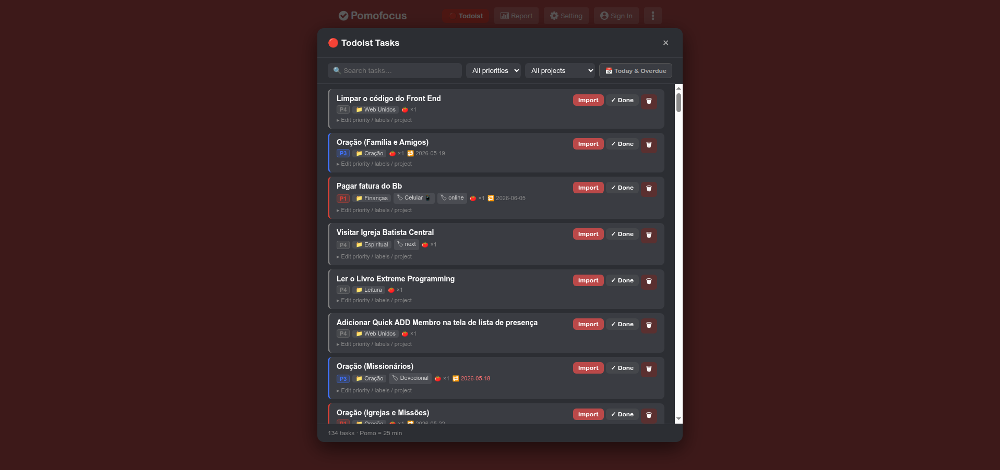

# 🍅 Pomofocus × Todoist

> A userscript that brings your Todoist tasks directly into [Pomofocus](https://pomofocus.io/app).

**Other languages:** [🇧🇷 Português](./README.pt-BR.md) · [🇪🇸 Español](./README.es.md)

---

## TL;DR

1. Install [Violentmonkey](https://violentmonkey.github.io/get-it/) (or Tampermonkey)
2. [Click here to install the script](./pomofocus-todoist.user.js) *(or paste manually)*
3. Set your Todoist API token in the `API_KEY` field
4. Open [pomofocus.io/app](https://pomofocus.io/app) → click the 🔴 **Todoist** button

---



---

## Features

| Action | Description |
|---|---|
| **Import** | Adds task to Pomofocus with auto-calculated pomodoro count |
| **✓ Done** | Marks task complete in Todoist |
| **🗑 Delete** | Permanently deletes task from Todoist *(confirmation required)* |
| **Priority** | Change P1–P4 inline |
| **Labels** | Toggle labels inline |
| **Project** | Move to another project inline |
| **Filters** | Search, priority, project, and 📅 Today & Overdue |

### Pomodoro Auto-Calculation

If a Todoist task has a **duration** set (e.g. 90 min), the script divides it by your current Pomofocus session length (read live from settings) and rounds up.

```
90 min task ÷ 25 min pomo = 🍅 × 4
```

Tasks without a duration default to **1 pomodoro**.

---

## Installation

### Desktop (Chrome, Firefox, Edge)

#### 1. Install the extension

| Extension | Chrome | Firefox |
|---|---|---|
|  | [Chrome Web Store](https://chrome.google.com/webstore/detail/violentmonkey/jinjaccalgkegedbjlphkgodlihkgiej) | [Firefox Add-ons](https://addons.mozilla.org/firefox/addon/violentmonkey/) |
| Tampermonkey | [Chrome Web Store](https://chrome.google.com/webstore/detail/tampermonkey/dhdgffkkebhmkfjojejmpbldmpobfkfo) | [Firefox Add-ons](https://addons.mozilla.org/firefox/addon/tampermonkey/) |

> **Recommended:** Violentmonkey — free, open-source, no telemetry.

#### 2. Install the script

**Option A — Direct install** *(if extension supports it)*:
Click the raw file link and the extension will prompt you to install.

**Option B — Manual**:
1. Copy the contents of [`pomofocus-todoist.user.js`](./pomofocus-todoist.user.js)
2. Open Violentmonkey → **Dashboard** → **+** (New script)
3. Paste and save (`Ctrl+S`)

#### 3. Set your API token

Open the script editor and find line:
```js
const API_KEY = 'YOUR_TODOIST_API_TOKEN_HERE';
```
Replace the placeholder with your token:
> **Todoist** → Settings → Integrations → Developer → **API token** → Copy

---

### Android (Kiwi Browser + Violentmonkey)

> Kiwi Browser supports Chrome extensions on Android, including Violentmonkey.

1. Install [Kiwi Browser](https://play.google.com/store/apps/details?id=secure.unblock.unlimited.proxy.snap.hotspot.shield) from Google Play
2. Open Kiwi → menu (⋮) → **Extensions** → **+ (from store)**
3. Search **Violentmonkey** → Install → [Violentmonkey on Chrome Web Store](https://chrome.google.com/webstore/detail/violentmonkey/jinjaccalgkegedbjlphkgodlihkgiej)
4. Follow steps 2–3 from the Desktop section above

---

## Getting Your Todoist API Token

1. Log in to [todoist.com](https://todoist.com)
2. Click your avatar → **Settings**
3. Go to **Integrations** → **Developer**
4. Copy your **API token**

> ⚠️ **Never share your API token.** It gives full access to your Todoist account.

---

## How It Works

The script injects a **🔴 Todoist** button into the Pomofocus header. Clicking it opens a modal that:

1. Fetches your active tasks from the Todoist API v1 (paginated)
2. Shows tasks with project, labels, priority, due date, and calculated pomodoros
3. Lets you import, complete, delete, or edit tasks without leaving Pomofocus

Task creation in Pomofocus uses React's internal input setter to properly trigger state updates — no DOM hacks that break on updates.

---

## Requirements

- A browser that supports userscript extensions
- A [Todoist](https://todoist.com) account (free plan works)
- A [Pomofocus](https://pomofocus.io) account is **not** required (works as guest)

---

## License

MIT — do whatever you want with it.
